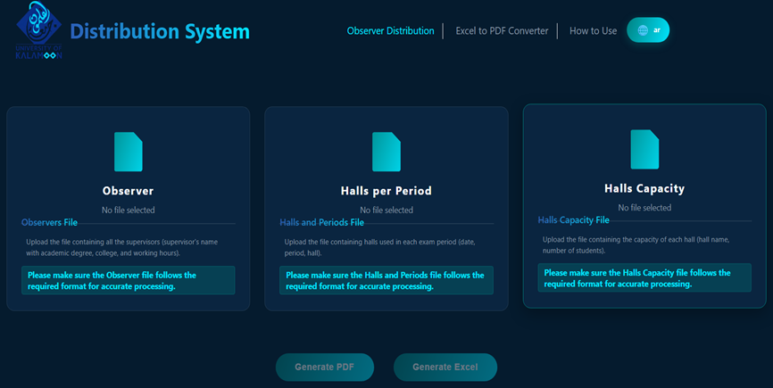
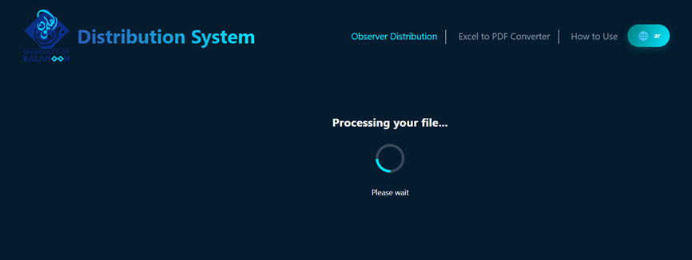
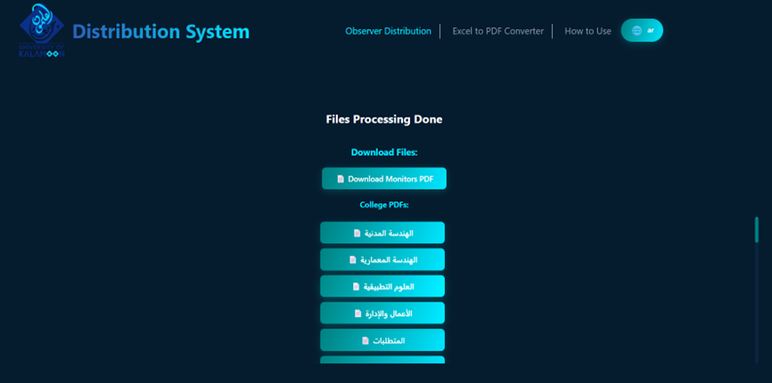
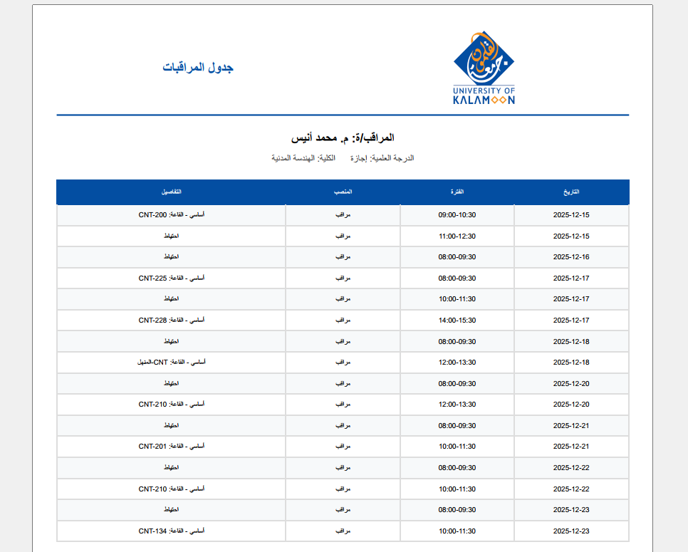
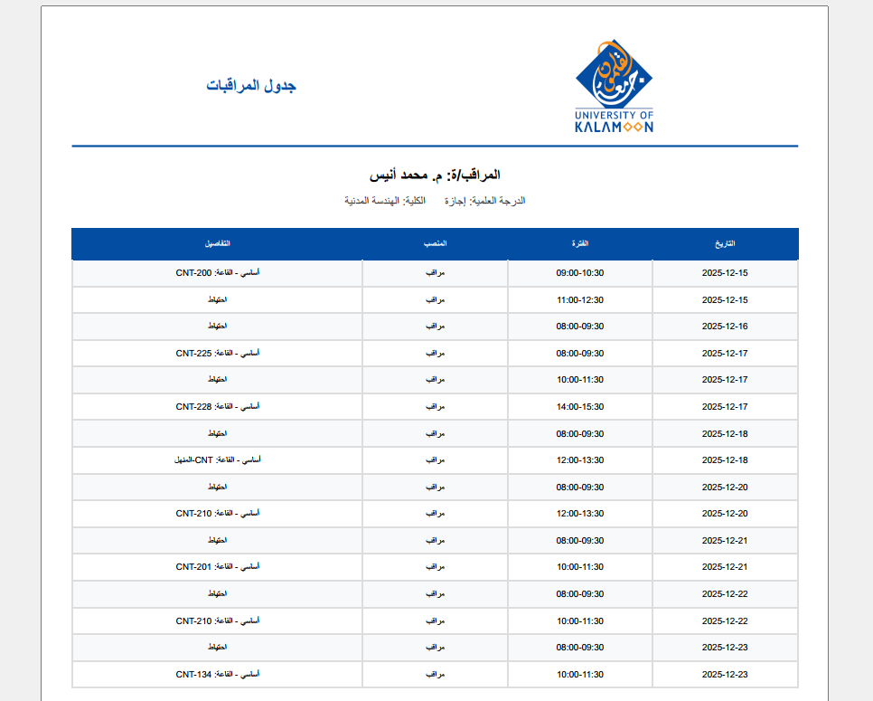

# Exam Hall Proctor Distribution System

A web-based system for automating university exam proctor assignments across examination halls while considering scheduling constraints, staff availability, workload balance, academic roles, and hall requirements.

The system processes structured Excel files, validates and cleans the uploaded data, applies assignment rules, and generates organized Excel and PDF reports for proctors, colleges, and examination halls.

---

## Overview

University exam proctor scheduling can become difficult when there are many exam periods, halls, staff members, and scheduling constraints.

This project was developed to automate that process and reduce the amount of manual work required for assigning proctors.

The system handles:

- Proctor availability
- Exam dates and periods
- Hall requirements
- Academic roles
- Daily assignment limits
- Reserve proctor allocation
- Scheduling conflicts
- Workload balancing
- Report generation

The project combines backend development, data processing, validation, scheduling logic, and automated document generation in one application.

---

## Main Features

- Automated proctor assignment
- Main and reserve proctor allocation
- Schedule conflict prevention
- Staff availability handling
- Workload balancing between proctors
- Academic role-based assignment
- Excel file upload and processing
- Workbook validation
- Data cleaning and normalization
- Excel report generation
- PDF report generation
- College-level reports
- Hall-level reports
- Arabic-compatible PDF output
- Responsive web interface
- Automated testing
- Cross-platform executable packaging

---

## How the System Works

The application workflow consists of several main stages.

### 1. Data Upload

The user uploads the required Excel files containing:

- Proctor information
- Exam schedules
- Examination halls
- Hall capacity information

### 2. Validation

The uploaded files are checked before processing.

The system validates:

- Workbook structure
- Required worksheets
- Required columns
- Missing information
- Invalid records
- Incorrect data formats

### 3. Data Cleaning

The application cleans and normalizes the uploaded data before the assignment process.

This stage prepares the data for consistent processing.

### 4. Proctor Assignment

The system applies the distribution rules and generates:

- Main proctor assignments
- Reserve proctor assignments

The scheduling process considers staff availability, exam periods, workload, hall requirements, and assignment constraints.

### 5. Report Generation

After completing the assignment process, the system generates structured reports in:

- Excel format
- PDF format

Reports can be generated for individual proctors, colleges, and examination halls.

---

## Input Files

The system works with structured Excel files.

### Proctor Data

The proctor file may contain information such as:

- Name
- Academic degree
- College or department
- Working days
- Employment status
- Availability
- Reason for exclusion from proctoring, if applicable

### Exam Schedule

The exam schedule contains information such as:

- Exam date
- Exam period
- Examination hall

### Hall Information

Hall information includes data such as:

- Hall name
- Hall capacity
- Number of students

---

## Assignment Rules

The distribution process follows several scheduling constraints and institutional rules.

Examples include:

- Each proctor has a limited number of main assignments per day
- Hall supervisors are selected according to academic role requirements
- Staff members with limited working days receive higher scheduling priority
- Certain academic staff members are excluded from reserve assignments
- Reserve proctors are assigned separately from hall assignments
- Main assignments are generated before reserve assignments
- Scheduling conflicts are prevented
- Workload is distributed as evenly as possible
- Staff availability is considered during assignment

These rules are applied during the scheduling process to create a balanced and practical distribution.

---

## Outputs

The system generates several types of output files.

### Excel Reports

The application can generate structured Excel reports containing:

- Main proctor assignments
- Reserve assignments
- Exam dates
- Exam periods
- Hall assignments
- College information

### PDF Reports

The system generates PDF reports for:

- Individual proctors
- Colleges
- Examination halls

The PDF generation process includes support for Arabic text and bidirectional text rendering.

---

## Technologies

### Backend

- Node.js
- Express.js
- JavaScript

### File Upload and Data Processing

- Multer
- XLSX

### PDF Generation

- Puppeteer
- PDFKit
- Arabic Reshaper
- Arabic Persian Reshaper
- Bidi

### Development and Packaging

- npm
- pkg

### Development Tools

- Git
- GitHub
- VS Code
- Postman

---

---

## Screenshots

### Main Distribution Interface

Upload observer information, exam schedules, and hall capacity files before generating the final assignments.



### File Processing

The system validates and processes uploaded Excel files before running the assignment workflow.



### Generated Reports

After processing is complete, the system provides downloadable reports for monitors and individual colleges.



### Built-in User Guide

The application includes an integrated user guide explaining the required input files and the complete distribution workflow.



### Example PDF Output

The system generates structured Arabic PDF reports containing each proctor's schedule, assignment type, exam period, and hall.



---

## Project Structure

```text
exam-hall-proctor-distribution-system/
├── assets/
│   └── images/
│
├── public/
│   ├── css/
│   │   └── style.css
│   ├── images/
│   ├── js/
│   │   └── index.js
│   └── index.html
│
├── server/
│   ├── app.js
│   ├── browser/
│   │   └── browser.js
│   │
│   └── src/
│       ├── cleaners/
│       │   ├── hallsCleaner.js
│       │   ├── monitorsCleaner.js
│       │   └── periodsCleaner.js
│       │
│       ├── config/
│       │   └── paths.js
│       │
│       ├── data/
│       │   └── dataStore.js
│       │
│       ├── errors/
│       │   └── appError.js
│       │
│       ├── filters/
│       │   └── monitorsFilter.js
│       │
│       ├── generators/
│       │   ├── htmlGenerators.js
│       │   └── pdfGenerators.js
│       │
│       ├── helpers/
│       │   ├── collegeHelper.js
│       │   ├── excelBuilder.js
│       │   └── processData.js
│       │
│       ├── middleware/
│       │   └── upload.js
│       │
│       ├── routes/
│       │   ├── convertRoutes.js
│       │   ├── distributionRoutes.js
│       │   ├── excelRoutes.js
│       │   ├── pdfRoutes.js
│       │   └── uploadRoutes.js
│       │
│       ├── utils/
│       │   ├── dateUtils.js
│       │   ├── hallUtils.js
│       │   └── htmlUtils.js
│       │
│       ├── validation/
│       │   └── workbookValidation.js
│       │
│       └── views/
│           └── viewBuilders.js
│
├── tests/
│   ├── distribution.test.js
│   ├── run-tests.js
│   └── workbookValidation.test.js
│
├── uploads/
│   └── .gitkeep
│
├── output/
│   └── .gitkeep
│
├── package.json
├── package-lock.json
├── .gitignore
└── README.md
```
